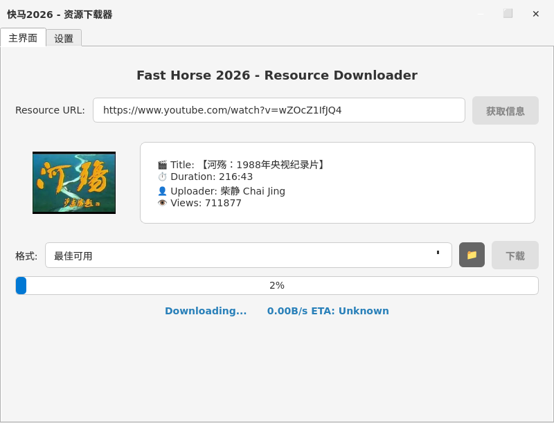
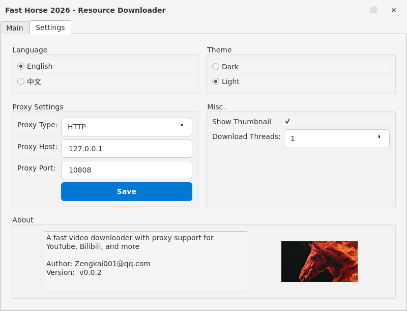

# Fast-Horse-2026 - Video Resource Downloader


A powerful, feature-rich desktop application for downloading videos from YouTube, Bilibili, and other platforms with a modern PySide6 interface, bilingual support, and advanced configuration options.

## ✨ **Features**

### **Core Features**
- **Multi-Platform Support**: Download videos from YouTube, Bilibili (B站), and more
- **Modern GUI**: Clean, professional interface with dark/light theme support
- **Video Preview**: Fetch and display video information (title, duration, uploader, views)
- **Multiple Formats**: Download in various qualities (1080p, 720p, 480p, MP3 audio)
- **Playlist Support**: Download entire playlists with automatic folder organization
- **Progress Tracking**: Real-time download progress with speed and ETA
- **Folder Selection**: Choose custom download location

### **Advanced Features**
- **🌐 Bilingual UI**: Full Chinese/English language support with dynamic switching
- **🔧 Configurable Proxy**: SOCKS5/HTTP proxy support with integrated settings
- **🎨 Theme Switching**: Dark/Light theme toggle with preference saving
- **📱 Tab Interface**: Modern tab layout (Main/Settings) for better user experience
- **⚡ Performance**: Multi-threaded downloads with configurable thread count
- **🖼️ Thumbnail Preview**: Display video thumbnail in preview area
- **📶 Resumable Downloads**: Automatic resume support for interrupted downloads

## 📸 **Screenshots**





## 🚀 **Quick Start**

### **Download Pre-built Executable**

#### **Linux**
1. Download `Fast-Horse-2026-linux-x64.tar.gz` from releases
2. Extract: `tar -xzf Fast-Horse-2026-linux-x64.tar.gz`
3. Run: `./Fast-Horse-2026`

#### **Windows**
1. Download `Fast-Horse-2026-v0.0.2-win-x64.zip` from releases
2. Extract the ZIP file
3. Run: Double-click `Fast-Horse-2026.exe` or use `run.bat`

### **From Source**
```bash
# Clone repository
git clone https://gitee.com/kzeng/fast-horse-2026.git
cd fast-horse-2026

# Create virtual environment
python -m venv venv
source venv/bin/activate  # Linux/Mac
# venv\Scripts\activate   # Windows

# Install dependencies
pip install -r requirements.txt

# Run application
cd src
python main.py
```

## 📦 **Installation**

### **Dependencies**
- Python 3.10+
- PySide6 (GUI framework)
- yt-dlp (YouTube download engine)
- PyYAML (configuration)
- secretstorage (browser cookies access)

### **FFmpeg (Recommended)**
For MP4 downloads with audio, install FFmpeg:
- **Linux**: `sudo apt install ffmpeg`
- **macOS**: `brew install ffmpeg`
- **Windows**: Download from [ffmpeg.org](https://ffmpeg.org/)

## 🎮 **Usage**

### **Supported Platforms**
- **YouTube**: Full support with format selection and playlist download
- **Bilibili (B站)**: Full support with smart format detection
- **Other Platforms**: yt-dlp supported platforms

### **Basic Usage**
1. **Launch** the application
2. **Paste video URL** (YouTube or Bilibili) in the input field
3. **Click "Fetch Info"** to load video details
4. **Select format** from dropdown
5. **Choose download folder** (optional)
6. **Click "Download"** to start

### **Advanced Features**
- **Language Switch**: Settings tab → Language section → English/中文
- **Proxy Settings**: Settings tab → Proxy Settings section
- **Theme Switch**: Settings tab → Theme section → Dark/Light
- **Download Threads**: Settings tab → Misc section → Select 1/2/4/8 threads
- **Show Thumbnail**: Settings tab → Misc section → Toggle thumbnail display
- **About Info**: Settings tab → About section with author and version
- **Playlist Download**: Paste playlist URL, all videos download to playlist folder

## 🏗️ **Project Structure**

```
fast-horse-2026/
├── src/
│   ├── main.py                     # Application entry point
│   └── app/
│       ├── __init__.py
│       ├── main_window.py          # Main window UI with tab layout (QMainWindow)
│       ├── download_manager.py     # yt-dlp integration with proxy support
│       ├── translations.py         # Bilingual translation system
│       ├── style.qss               # Dark theme stylesheet
│       └── style_light.qss         # Light theme stylesheet
├── requirements.txt                # Python dependencies
├── build.sh                        # Build script for Linux
├── Fast-Horse-2026.spec           # PyInstaller specification
├── INSTALL.md                      # Detailed installation guide
├── BUILD_SUMMARY.md               # Build and feature documentation
└── README.md                       # This file
```

## ⚙️ **Configuration**

### **Tab Interface**
The application features a modern tab-based interface:
- **Main Tab**: Video downloader interface (URL input, format selection, progress)
- **Settings Tab**: All configuration options in one place:
  - **Language Section**: Switch between English/中文
  - **Theme Section**: Toggle between Dark/Light themes
  - **Proxy Settings**: Configure SOCKS5/HTTP/No proxy
  - **Misc Section**: Download threads (1/2/4/8), show thumbnail toggle
  - **About Section**: Author info (Zengkai001@qq.com), version (0.0.2), and application logo

### **Bilibili Support**
- Automatic URL detection for Bilibili videos
- Smart format selection (`bestvideo+bestaudio`) for optimal downloads
- Extended timeout for larger Bilibili videos
- Requires Firefox cookies for access (login in Firefox first)

### **Proxy Settings**
Configure proxy through Settings tab → Proxy Settings:
- **No Proxy**: Direct connection
- **SOCKS5**: SOCKS5 proxy support
- **HTTP**: HTTP proxy support
- Settings saved automatically

### **Language Settings**
- **English**: Complete English UI
- **中文**: Complete Chinese UI
- Dynamic switching without restart

### **Theme Settings**
- **Dark Theme**: Professional dark interface (default)
- **Light Theme**: Clean light interface
- Preference saved between sessions

## 🔧 **Development**

### **Building from Source**

#### **Linux / macOS**
```bash
# Install build dependencies
pip install pyinstaller

# Build executable
./build.sh

# Output: dist/Fast-Horse-2026
# Package: Fast-Horse-2026-linux-x64.tar.gz
```

#### **Windows**
```batch
# Install build dependencies
pip install pyinstaller

# Build executable
build.bat

# Output: dist\Fast-Horse-2026.exe
# Package: Fast-Horse-2026-v0.0.2-win-x64.zip
```

**Note**: The Windows build script (`build.bat`) will automatically download FFmpeg and Deno.

### **Adding New Translations**
1. Edit `src/app/translations.py`
2. Add translation keys to both `_english_translations()` and `_chinese_translations()`
3. Use `translator.get('key')` in UI code

### **Adding New Themes**
1. Create new `.qss` file in `src/app/`
2. Update `load_stylesheet()` method in `main_window.py`
3. Add theme option to menu

## 🐛 **Troubleshooting**

### **Common Issues**
1. **"Bot detection"**: Log into the video site in browser first, app uses browser cookies
2. **"No video formats"**: Install Deno for JavaScript challenge solving
3. **"Network error"**: Check proxy settings or try without proxy
4. **"FFmpeg not found"**: Install FFmpeg for MP4 with audio
5. **Bilibili HTTP 412**: Ensure Firefox is logged into Bilibili, cookies required

### **Bilibili Specific**
- **Cookies Required**: Bilibili requires Firefox cookies for access
- **Login First**: Open Bilibili in Firefox and log in before using the app
- **Extended Timeout**: Bilibili videos may take longer to fetch (25s timeout)

### **Deno Installation (for JS challenges)**
```bash
# Install Deno
curl -fsSL https://deno.land/install.sh | sh

# Add to PATH
export PATH="$HOME/.deno/bin:$PATH"
```

## 📄 **License**

MIT License - see [LICENSE](LICENSE) file for details.

## 🙏 **Acknowledgments**

- [yt-dlp](https://github.com/yt-dlp/yt-dlp) - Powerful YouTube download engine
- [PySide6](https://www.qt.io/qt-for-python) - Qt Python bindings for GUI
- [FFmpeg](https://ffmpeg.org/) - Multimedia framework
- [Deno](https://deno.land/) - JavaScript/TypeScript runtime for JS challenges

## 🤝 **Contributing**

1. Fork the repository
2. Create feature branch: `git checkout -b feature/amazing-feature`
3. Commit changes: `git commit -m 'Add amazing feature'`
4. Push to branch: `git push origin feature/amazing-feature`
5. Open Pull Request

## 📞 **Support**

- **Issues**: [GitHub Issues](https://gitee.com/kzeng/fast-horse-2026/issues)
- **Documentation**: See [INSTALL.md](INSTALL.md) for detailed instructions

---

## 🇨🇳 **中文文档**

### **快速开始**

#### **Linux**
1. **下载预编译版本**: 从发布页面下载 `Fast-Horse-2026-linux-x64.tar.gz`
2. **解压**: `tar -xzf Fast-Horse-2026-linux-x64.tar.gz`
3. **运行**: `./Fast-Horse-2026`

#### **Windows**
1. **下载预编译版本**: 从发布页面下载 `Fast-Horse-2026-v0.0.2-win-x64.zip`
2. **解压**: 解压 ZIP 文件
3. **运行**: 双击 `Fast-Horse-2026.exe` 或运行 `run.bat`

### **从源码运行**
```bash
# 克隆仓库
git clone https://gitee.com/kzeng/fast-horse-2026.git
cd fast-horse-2026

# 创建虚拟环境
python -m venv venv
source venv/bin/activate  # Linux/Mac
# venv\Scripts\activate   # Windows

# 安装依赖
pip install -r requirements.txt

# 运行应用
cd src
python main.py
```

### **使用说明**
1. **主界面标签页**: 粘贴视频链接（YouTube或B站），获取视频信息，选择格式，下载视频
2. **设置标签页**: 
   - **语言设置**: 切换英文/中文界面
   - **主题设置**: 切换深色/浅色主题
   - **代理设置**: 配置SOCKS5/HTTP代理
   - **杂项设置**: 下载线程数（1/2/4/8）、显示封面开关
   - **关于信息**: 作者Zengkai001@qq.com，版本0.0.2，应用图标

### **B站支持**
- **自动检测**: 自动识别B站视频链接
- **智能格式**: 自动选择最佳格式（bestvideo+bestaudio）
- **延长超时**: B站视频较大，获取时间更长（25秒超时）
- **需要Cookies**: B站需要Firefox登录cookie

### **功能特点**
- **多平台支持**: 支持YouTube、B站( Bilibili)等主流视频平台
- **现代化标签界面**: 主界面/设置标签页布局，操作更直观
- **双语支持**: 完整的中文/英文界面，实时切换
- **代理配置**: 支持SOCKS5/HTTP代理，解决网络限制
- **主题切换**: 深色/浅色主题，保护眼睛
- **播放列表支持**: 下载整个播放列表，自动创建文件夹
- **视频封面**: 预览区域显示视频缩略图
- **多线程下载**: 支持1/2/4/8线程下载
- **断点续传**: 支持中断后继续下载

### **常见问题**
1. **"机器人检测"**: 先在浏览器登录视频网站，应用会使用浏览器cookies
2. **"没有视频格式"**: 安装Deno解决JavaScript挑战
3. **"网络错误"**: 检查代理设置或尝试不使用代理
4. **"FFmpeg未找到"**: 安装FFmpeg以支持带音频的MP4下载
5. **B站HTTP 412错误**: 确保Firefox已登录B站，需要cookies

### **B站特定问题**
- **需要Cookies**: B站需要Firefox登录cookie才能访问
- **先登录**: 使用前请在Firefox中打开B站并登录
- **延长超时**: B站视频获取可能需要更长时间（25秒超时）

### **Deno安装（解决JS挑战）**
```bash
# 安装Deno
curl -fsSL https://deno.land/install.sh | sh

# 添加到PATH
export PATH="$HOME/.deno/bin:$PATH"
```

---
**Fast-Horse-2026** - Fast, feature-rich video downloader for YouTube, Bilibili, and more!
**快马2026** - 为YouTube、B站等设计的快速、功能丰富的视频下载器！